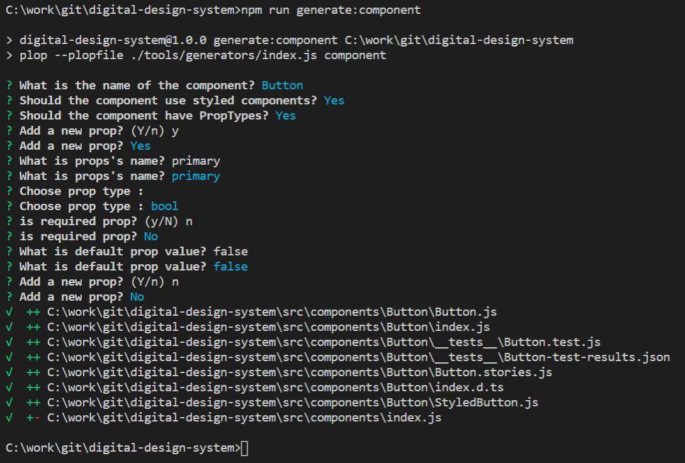

# Design System for web

The Digital Design System is React UI framework for building web application, it contains set of reusable React components that provides out of the box capability for accessibility, theaming support and responsiveness.

## Tools Stack

Building Components

-   [Storybook](https://storybook.js.org) for UI component development and visual testing
-   [Styled-components](https://www.styled-components.com/) for component-scoped styling
-   [React](https://reactjs.org/) declarative component-centric UI

Development Tools

-   [VSCode](https://code.visualstudio.com/) Visual Studio Code is a source-code editor developed by Microsoft for Windows, Linux and macOS.
-   [ESLint](https://eslint.org/) A pluggable and configurable linter tool for identifying and reporting on patterns in JavaScript. Maintain your code quality with ease.
-   [Prettier](https://prettier.io/) An opinionated code formatter; Supports many languages; Integrates with most editors; Has few options.
-   [Jest](https://jestjs.io/en/) A delightful JavaScript Testing Framework with a focus on simplicity.
-   [React Testing Library](https://testing-library.com/docs/react-testing-library/intro) A very light-weight solution for testing React components.

## Contributing

Setup Development Env

-   Setup above mentioned devlopment tools and configure VSCode Prettier plugin to format code after save file.
-   Fork this repo, and develop on your own local clone.
-   <code>cd</code> into your local cloned repository and install your node_modules
    with <code>npm install</code>
-   Start storybook with <code>npm run storybook</code>
-   Create a new branch and do your changes in it.
-   Once you are done with your changes push everything to your local repository's branch.
-   Finally create a pull request from your branch to master, PR will be reviewed and if erverything looks fine we will merge it.

Development Scripts

-   <code>npm run storybook</code>: Executes all stories and opens storybook UI
-   <code>npm run test -- --component=<Component's dir name></code>: Execute given components tests Ex. <code>npm run test -- --component=heading</code> if component option not provided or component dir not found will execute tests for all components
-   <code>npm run test:update -- --component=<Component's dir name></code>: Execute given components tests and update snapshots Ex. <code>npm run test:update -- --component=heading</code>

Generators
Following are the generators which will create required scaffolding files

-   Component <code>npm run generate:component</code>
    
